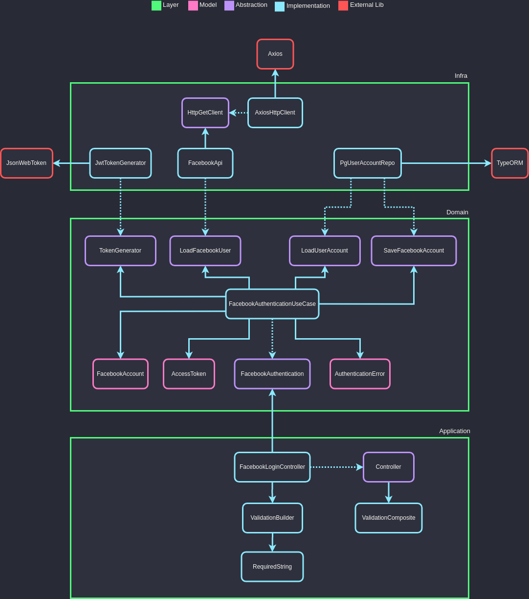
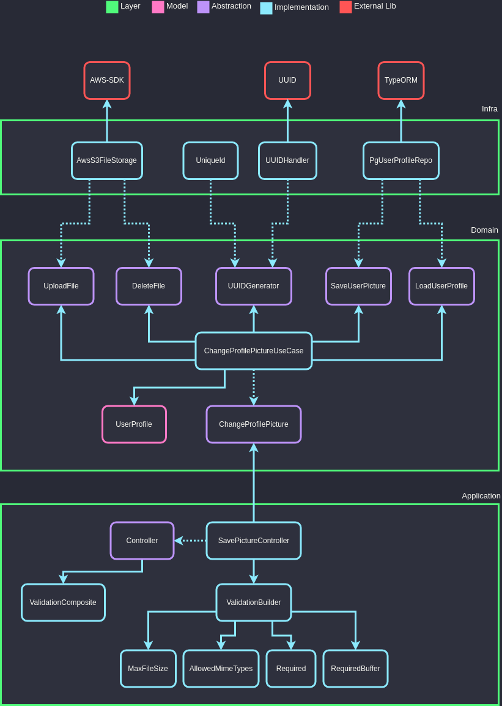

# **Advanced Node project**

The objective of the project is to build an API with a well-defined and decoupled architecture, using TDD (test-oriented programming) as a work methodology, Clean Architecture to distribute responsibilities in layers, always following the principles of SOLID and, whenever possible by applying Design Patterns to solve some common problems.

> ## Principles

- Single Responsibility
- Open Closed
- Liskov Substitution
- Interface Segregation
- Dependency Inversion
- Separation of Concerns
- Don't Repeat Yourself
- You Aren't Gonna Need It
- Keep It Simple
- Composition Over Inheritance
- Small Commits

> ## Design Patterns

- Factory
- Adapter
- Composite
- Decorator
- Command
- Dependency Injection
- Abstract Server
- Composition Root
- Builder
- Template Method
- Singleton
- Chain of Responsibility
- Proxy

> ## Code Smells (Anti-Patterns)

- Blank Lines
- Comments
- Data Clumps
- Divergent Change
- Duplicate Code
- Inappropriate Intimacy
- Feature Envy
- Large Class
- Long Method
- Long Parameter List
- Middle Man
- Primitive Obsession
- Refused Bequest
- Shotgun Surgery
- Speculative Generality

> ## Methodologies e Designs

- TDD
- Clean Architecture
- DDD
- Refactoring
- GitFlow
- Modular Design
- Dependency Diagrams
- Use Cases
- Spike (Agile)

> ## Libs and tools

- NPM
- Typescript
- Git
- Jest
- Ts-Jest
- Jest-Mock-Extended
- TypeORM
- Aws-Sdk
- Multer
- UUID
- Axios
- Postgres
- JsonWebToken
- Express
- Cors
- Supertest
- Husky
- Lint Staged
- Eslint
- Standard Javascript Style
- Rimraf
- In-Memory Postgres Server
- Module-Alias
- Npm Check
- Travis CI
- Coverals
- DotEnv
- Ts-Node-Dev

> ## Typescript Features

- Advanced POO
- Strict Mode
- Interface
- TypeAlias
- Namespace
- Utility Types
- Paths Modularization
- Configurations
- Build

> ## Test Features

- Unit tests
- Integration tests
- Tess coverage
- Test Doubles
- Mocks
- Stubs
- Spies
- Fakes

> ## Use cases

#### Facebook authentication

#### Change profile picture

